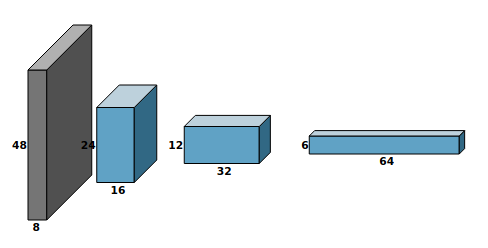
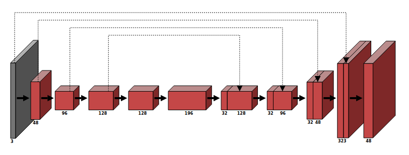
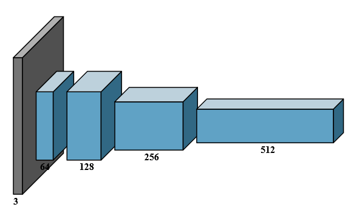

# DrawCNN

DrawCNN is a python script to visualize CNN architectures as an SVG (by default it writes to output.svg). The script requires Python 3 but has no additional dependencies.

## Usage Examples

``python draw.py 8 16 32 64 --pool 2 2 2 1 --sizes 48 24 12 6 --spacing 50``

``python draw.py 3 48 96 128 128 196 32-128 32-96 32-48 32-3 48 --pool 2 2 1 1 1 1 1 1 1 0.5 1 0.5  --connections 0,13 1,11 2,9 3,7 --color red --scale-width 0.5 --font-size 6 --arrow-size 25``

### ResNet

``python draw.py 3 64 128 256 512 --pool 4 1 2 2 2 --sqrt-height=True --spacing 15``

